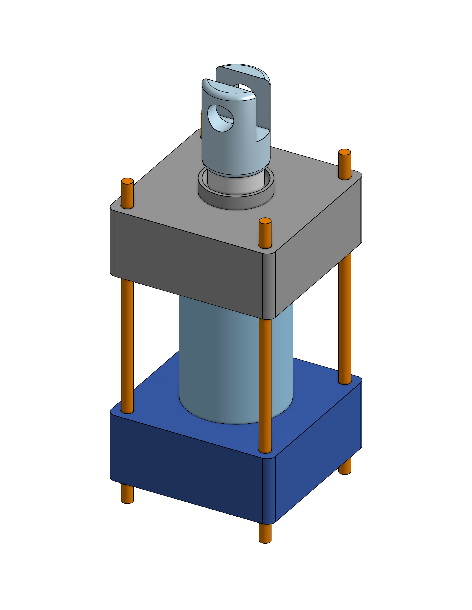

<h1>Engineering 3</h1>

This is my engineering 3 notebook for the 2023-2024 school year! This readme will be the home of my documentation for all of the non-project assignments this year.

<h2 name="TableOfContents"> Table of Contents</h2>
<h3>Code</h3>
<ul>
<li><a href="#TableOfContents">Table of Contents</a></li>
<li><a href="#CircuitPythonServo">CircuitPython Servo</a></li>
<li><a href="#DistanceSensor">Distance Sensor</a></li>
<li><a href="#MotorControl">Motor Control</a></li>
<li><a href="#Photointerrupter">Photointerrupter</a></li>
<li><a href="#RotaryEncoder">Rotary Encoder</a></li>
</ul>
<h3>CAD</h3>
<ul>
<li><a href="#Hanger">Hanger</a></li>
<li><a href="#SwingArm">Swing Arm</a></li>
<li><a href="#MultiPartDesign">Multi Part Design Practice</a></li>
<li><a href="#VBLOCK">V-Block</a></li>
<li><a href="#AlignmentPlate">Alignment Plate</a></li>
<li><a href="#MicStand">Mic Stand</a></li>
</ul> 

<h1>Code</h1>
<h2 name="CircuitPythonServo">CircuitPython Servo</h2>

<h3>Description & Code</h3>

In this assignment, we were supposed to have a servo sweep its full length, using the adafruit_motor library. Once we finished that, we were supposed to control it with a set of buttons. Finally, we were supposed to replace the buttons with capacative touch, which is what I have documented.

<a href=servo.py>Code</a>  

<h3>Evidence</h3>
 

<h3>Wiring</h3>
 

<h3>Reflection</h3>

To start off, I looked at the <a href=https://learn.adafruit.com/circuitpython-essentials/circuitpython-servo>adafruit tutorial</a>, which provided recommended libraries and example code that happened to serve the assignment's purpose. It was a bit long winded, though. Wiring up the buttons was pretty simple, as I had done it last year. One thing that made it easier was the existence of internal pull-down resistors, which I could control with code, using the <code>DigitalIO</code> library. To convert to capacative touch actually simplified the wiring, as it replaced the buttons with wires going nowhere. The code was pretty simple too, with <code>TouchIO</code> being a drop-in replacement for <code>DigitalIO</code>.

<h2 name="DistanceSensor">Distance Sensor</h2>

<h3>Description & Code</h3>

In this assignment, we were supposed to to print the output of a distance sensor to the serial monitor. Then, we were supposed to have the onboard neopixel go through a range from red to green based on the distance.

<a href=distanceSensor.py>Code</a>  

<h3>Evidence</h3>
 

<h3>Wiring</h3>
 

<h3>Reflection</h3>

Wiring up the sensor was pretty simple, as it was the same as the arduino wiring. The code was pretty simple, using the <code>adafruit_hcsr04</code> library. To get the distance is as simple as <code>sensor.distance</code>, with your previously constructed sensor object. The neopixel was where I ran into problems. The array of colors I was constructing was causing a <code>MemoryError</code> on m0s, which was fixed by decreasing the granularity of the array. In addition, the colors were not displaying properly on a m0 neopixel, which turned out to be a problem with the specific m0 I was using.

<h2 name="MotorControl">Motor Control</h2>

<h3>Description & Code</h3>

In this assignment, we were supposed to control a motor with an m0 and transistor, based on the input from a potentiometer.

<a href=motorControl.py>Code</a>  

<h3>Evidence</h3>

https://github.com/Bhenry4/engr3/assets/82593996/76a8b65c-c936-4b85-b5dc-c69de8d50450

<h3>Wiring</h3>
 

<h3>Reflection</h3>

To start off, I used the wiring diagram provided in the assignment to wire the motor as well as my wiring diagram from last year to wire the potentiometer. The code was pretty simple, just taking input with the <code>AnalogIO</code> library and outputting it with the same library, without needing a conversion, thanks to the digital-to-analog converter on A0.

<h2 name="Photointerrupter">Photointerrupter</h2>

<h3>Description & Code</h3>

In this assignment, we were supposed to read the input of a photointerrupter, which just reads high if a beam inside it is broken.

<a href=photointerruptor.py>Code</a>  

<h3>Evidence</h3>

<h3>Wiring</h3>
 

<h3>Reflection</h3>

To start off, I used the wiring  provided in the assignment to wire the photointerrupter. Additionally, the wires on the photointerrupter I grabbed were well color coded. The code was somewhat simple, just taking input with the <code>DigitalIO</code> library and incrementing a counter every time it activated. The tricky part came when I needed to print status every 4 seconds, due to <code>time.sleep()</code> stopping the code from counting. So, I used <code>time.monotonic()</code>, which says how many seconds have passed since the program start.

<h2 name="RotaryEncoder">Rotary Encoder</h2>

<h3>Description & Code</h3>

In this assignment, we were supposed to read the input of a rotary encoder and use it to navigate a menu to set the color of an led.

<a href=encoder.py>Code</a>  

<h3>Evidence</h3>

<h3>Wiring</h3>
 

<h3>Reflection</h3>

To start off, I used the wiring  provided in the assignment to wire the photointerrupter. Additionally, the wires on the photointerrupter I grabbed were well color coded. The code was somewhat simple, just taking input with the <code>DigitalIO</code> library and incrementing a counter every time it activated. The tricky part came when I needed to print status every 4 seconds, due to <code>time.sleep()</code> stopping the code from counting. So, I used <code>time.monotonic()</code>, which says how many seconds have passed since the program start.

 <h1>CAD</h1>

<h2 name="Hanger">Hanger</h2>

<h3>Description & Onshape Document</h3>

In this assignment, we were supposed to make an object in onshape based off of a drawing.

<a href="https://cvilleschools.onshape.com/documents/3656c37de160df186ad31460/w/97f88d540f066ce1a1b3d70c/e/b28c79e86819e6866ffaf17a">Onshape Document</a>

<h3>Evidence</h3>

<h3>Reflection</h3>

This was a fairly straightforward drawing, good for a reintroduction to modelling off of them. After I got my onshape brain back on and figured out what plane I needed to start on(front), it went pretty smoothly. The only issue I ran into was the slots not extruding through because they were drawn on the top plane, instead of the top of the extrude.

<h2 name="SwingArm">Swing Arm</h2>

<h3>Description & Onshape Document</h3>

In this assignment, we were supposed to make a more complicated object in onshape based off of several drawings. Additionally, we needed to use variables and then change them and see if it worked.

<a href="https://cvilleschools.onshape.com/documents/0042a82a520dba5df34d9cc9/w/57d6eb520e93e28e07bff5b4/e/c636c7db1ea152cafce984da">Onshape Document</a>

<h3>Evidence</h3>

<h3>Reflection</h3>

This was a much more complex drawing, with variables, multiple views, and complex relations. After a few false starts, I started with the concentric circles, then the main beams coming out, the connecting beams and finally the ridges down the outside. Then, I used three extrudes to get the various levels. Finally, I made the holes at the end, and the arcs to go along with them, and added in the fillets.

<h2 name="MultiPartDesign">Multi Part Design Practice</h2>

<h3>Description & Onshape Document</h3>

In this assignment, we were supposed to make a quite complicated object in onshape based off of several drawings. Additionally, it had multiple parts that needed to be made in one part studio, and was the first time I worked with "design intent" page.

<a href="https://cvilleschools.onshape.com/documents/7b0711740bd21a4c8ef6a8fd/w/5e5197d2452925ab155713f4/e/06119b992c4f9479801a02ab">Onshape Document</a>

<h3>Evidence</h3>

<h3>Reflection</h3>

This drawing was split up into a <em>design intent</em> section, which showed how all the parts fit together and were relationed, and a section that had the diminsions of each part floating in space. The sections would have some dimensions in parentheses, meaning that those were defined in relation to other parts, meaning I had to look at the design intent. A tricky thing I ran in to was that the cylinder's material changed to lead for the last step, something you might not notice on first inspection of the drawing.

<h2 name="VBLOCK">V-Block</h2>

<h3>Description & Onshape Document</h3>

In this assignment, we were supposed to make a much simple part than the last one, from one drawing, and then modify it based off of subsequent drawings.

<a href="https://cvilleschools.onshape.com/documents/caf5e786b1bf6c64cb2e9ccd/w/de739c5a91059e34487da508/e/e20092cb6485a7cd21c79dfd">Onshape Document</a>

<h3>Evidence</h3>

<h3>Reflection</h3>

This was a pretty simple assignment, made even easier by the fact I had done it last year. Most of the work was done on one plane, with just the holes and the trough being separate. One issue I ran into was that when creating the versions, I missclicked and created it one change early. However, in a baffling design decision, onshape does not allow you to delete or change the location of versions, so there it stays.

<h2 name="AlignmentPlate">Alignment Plate</h2>

<h3>Description & Onshape Document</h3>

In this assignment, we were supposed to make a much simpler part than the last one, from one drawing.

<a href="https://cvilleschools.onshape.com/documents/b0ecf75f53c4ccfc53e1159b/w/1d67a8f1057ac58f1fad1305/e/b36750629e36ccd497b22813?renderMode=0&uiState=654bef6f1bdc086edd1bd3ca">Onshape Document</a>

<h3>Evidence</h3>

<h3>Reflection</h3>

This was a pretty simple assignment. I only needed one sketch to complete it, on the top plane, and it was made up of just two rectangles and six arcs. After that, it was just an extrude and a chamfer. I finished in 10 minutes and 53 seconds.

<h2 name="MicStand">Mic Stand</h2>

<h3>Description & Onshape Document</h3>

In this assignment, we had to make multiple parts based off of individual drawings and a design intent.

<a href="https://cvilleschools.onshape.com/documents/5893aaa51a9efa324c500153/w/65a2c9bd62bcaf87536d5cae/e/684a2cb6fc0b313408d8455f">Onshape Document</a>

<h3>Evidence</h3>

<h3>Reflection</h3>

This assignment was similar to the other multi-part studio assignment, with individual drawings and a design intent. To make the base mic holder part, I used the use tool and extruded upward, then modeled the rest of the holder from the side. This was similar with the base, where I revolved the main shape, and then made an extrude for the hole. An interesting part of this was that we had to addd a screw for Q2, so I needed to put it in an assembly.
